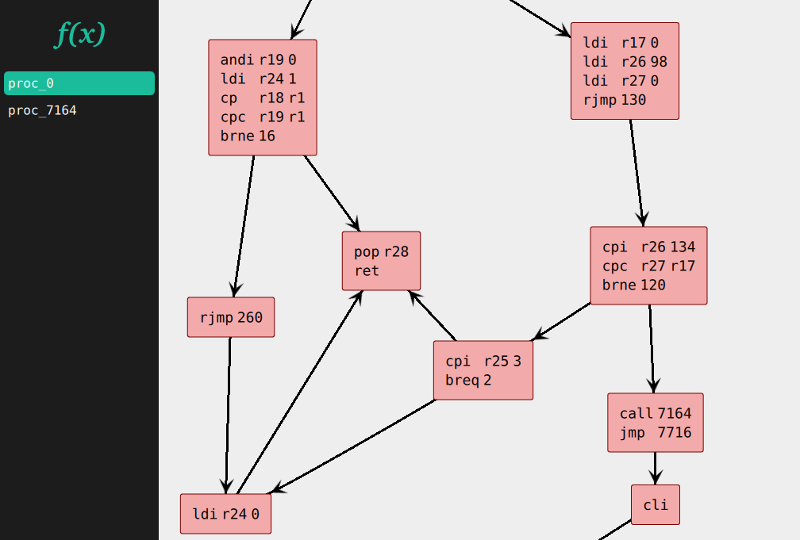

Introduction
============

Panopticon is a cross platform disassembler for reverse engineering.
It consists of a C++ library for disassembling, analysing decompiling
and patching binaries for various platforms and instruction sets.

Panopticon comes with GUI for browsing control flow graphs, displaying
analysis results, controlling debugger instances and editing the on-disk
as well as in-memory representation of the program.

Contributing
------------

Panopticon is licensed under GPLv3 and is Free Software. Hackers are
always welcome. See http://panopticon.re for our wiki and issue tracker.

Panopticon consists of two sub projects: libpanopticon and qtpanopticon.
The libpanopticon resides in the lib/ directory inside the repository. It
implements all disassembling and analysis functionality.
The libpanopticon has a test suite that can be found in lib/test/ after
compilation.

The qtpanopticon application is a Qt5 GUI for libpanopticon. The front
end uses QtQuick2 that interacts with libpanopticon using a thin C++
interface (the Session, Panopticon, LinearModel and ProcedureModel classes).
For the graph view qtpanopticon implements the graph layout algorithm used
by Graphviz' DOT program [Sugiyama]_. The Sugiyama class exposes this functionality
to QtQuick2. The QML files that reside in res/.
